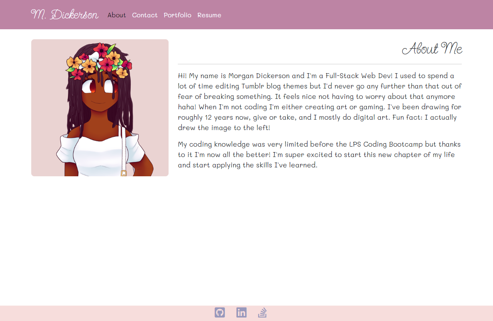
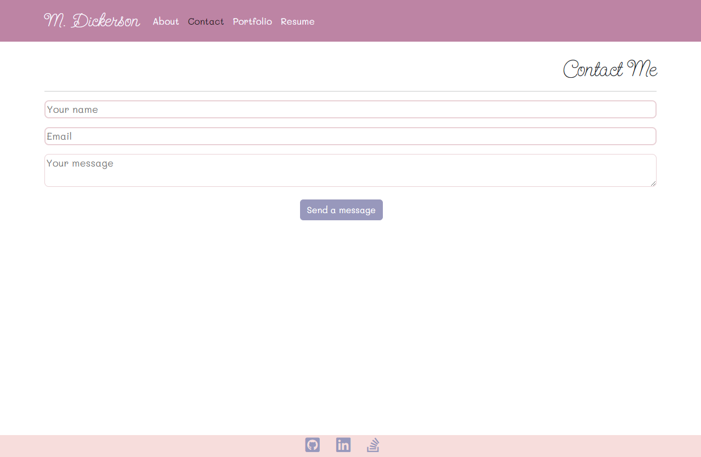

# Portfolio

## Description

The motivation and purpose behind this project was to re-create our first portfolio using react. It solves the problem of not having a professional portfolio that can be used to showcase our best works. It also solves the issue of not having a portfolio with a contact form. I learned a lot about using react, as well as styling with reacts own bootstrap.

## Table of Contents

- [Installation](#installation)
- [Usage](#usage)
- [Credits](#credits)
- [License](#license)

## Installation

After cloning all that's needed is an npm install

## Usage
Link to deployed app: [here](https://M-Dickerson.github.io/portfolio)

## Credits

Color palette used for styling: [here](https://visme.co/blog/pastel-colors/)

Heart icon used in tab: [here](https://icon-icons.com/icon/heart/183736)

HeroTofu was used for contact form: [docs](https://herotofu.com/)

Unsplashed used for images

## License

MIT License

A short and simple permissive license with conditions only requiring preservation of copyright and license notices. Licensed works, modifications, and larger works may be distributed under different terms and without source code.